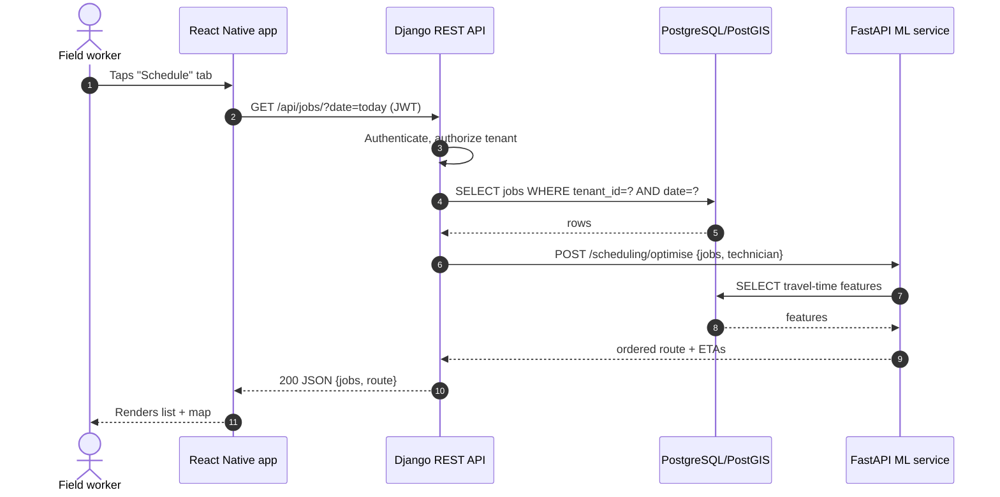
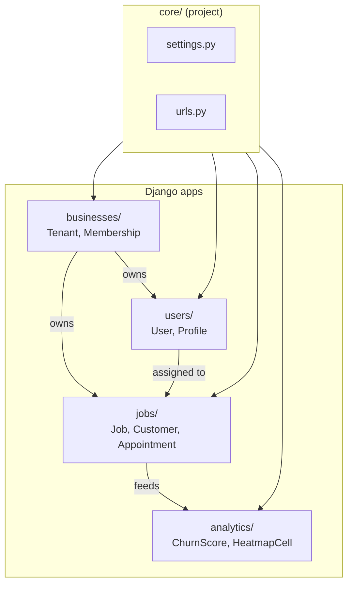
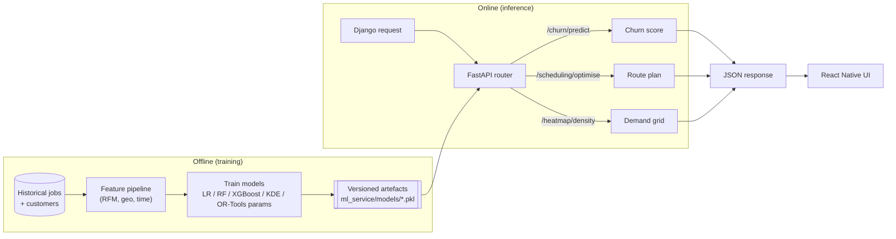
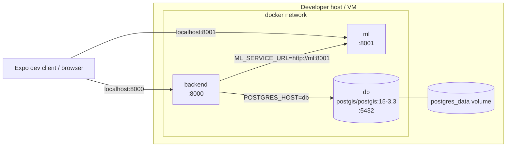
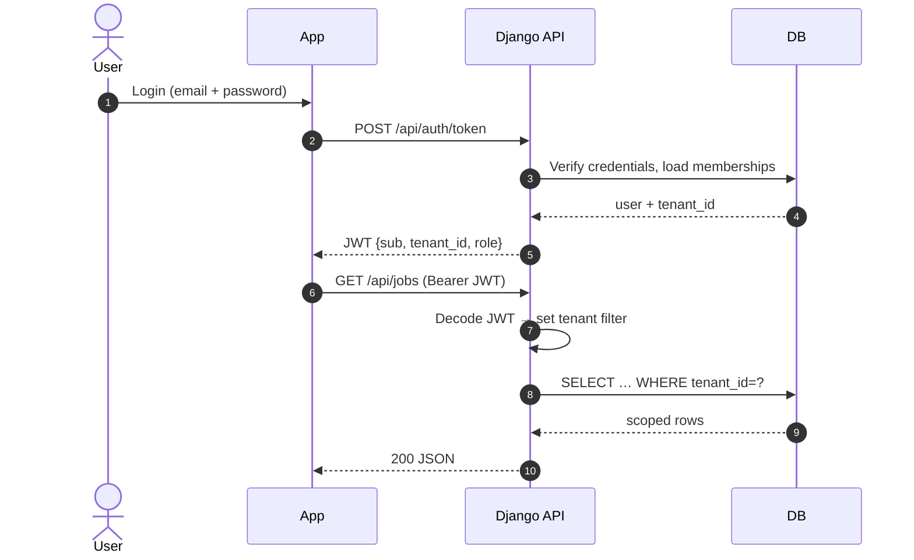

# FieldServe — System Architecture

Visual map of how the FieldServe CRM components connect end-to-end.
All diagrams are [Mermaid](https://mermaid.js.org/) — they render natively in VS Code's Markdown preview and on GitHub.

---

## 1. High-level system map

Shows the major tiers (client, API, ML, data, third-party) and how requests flow between them.

```mermaid
flowchart LR
    subgraph Client["Client tier"]v
        RN["React Native + Expo app<br/>(fieldserve-crm)<br/>iOS / Android / Web"]
    end

    subgraph Edge["Edge"]
        NGX["Reverse proxy / TLS<br/>(nginx in production)"]
    end

    subgraph API["Application tier"]
        DJ["Django REST API<br/>(fieldserve_backend, :8000)<br/>users · businesses · jobs · analytics"]
        FA["FastAPI ML service<br/>(ml_service, :8001)<br/>churn · scheduling · heatmap"]
    end

    subgraph Data["Data tier"]
        PG[("PostgreSQL + PostGIS<br/>:5432<br/>tenants · users · jobs · customers · geometry")]
        MOD[["ML model artefacts<br/>(ml_service/models)"]]
    end

    subgraph Ext["Third-party APIs"]
        MAP["Map tiles & geocoding<br/>(Mapbox / Google)"]
        AUTH["Auth provider<br/>(JWT issuer / optional OAuth)"]
    end

    RN -- HTTPS / JSON --> NGX
    NGX -- /api/* --> DJ
    DJ -- SQL (psycopg) --> PG
    DJ -- HTTP (internal) --> FA
    FA -- read features --> PG
    FA -- load --> MOD
    RN -- tiles --> MAP
    DJ -- verify token --> AUTH
```

---

## 2. Request lifecycle (typical read)

How a single user action — e.g. "open Schedule screen" — travels through the stack.



---

## 3. Backend app structure

How Django apps inside `fieldserve_backend/` relate, and which models each owns.



---

## 4. ML feature data flow

The three ML features each follow the same train-offline / serve-online pattern.



---

## 5. Deployment topology (Docker Compose)

Mirrors what is in [docker-compose.yml](docker-compose.yml).



---

## 6. Authentication & multi-tenancy



---

## How to view

- **VS Code**: open this file and press `Ctrl+K V` for side preview (built-in Markdown preview renders Mermaid).
- **GitHub**: diagrams render automatically in the file view.
- **Export**: install the *Markdown Preview Mermaid Support* extension to copy diagrams as PNG/SVG for the report.
